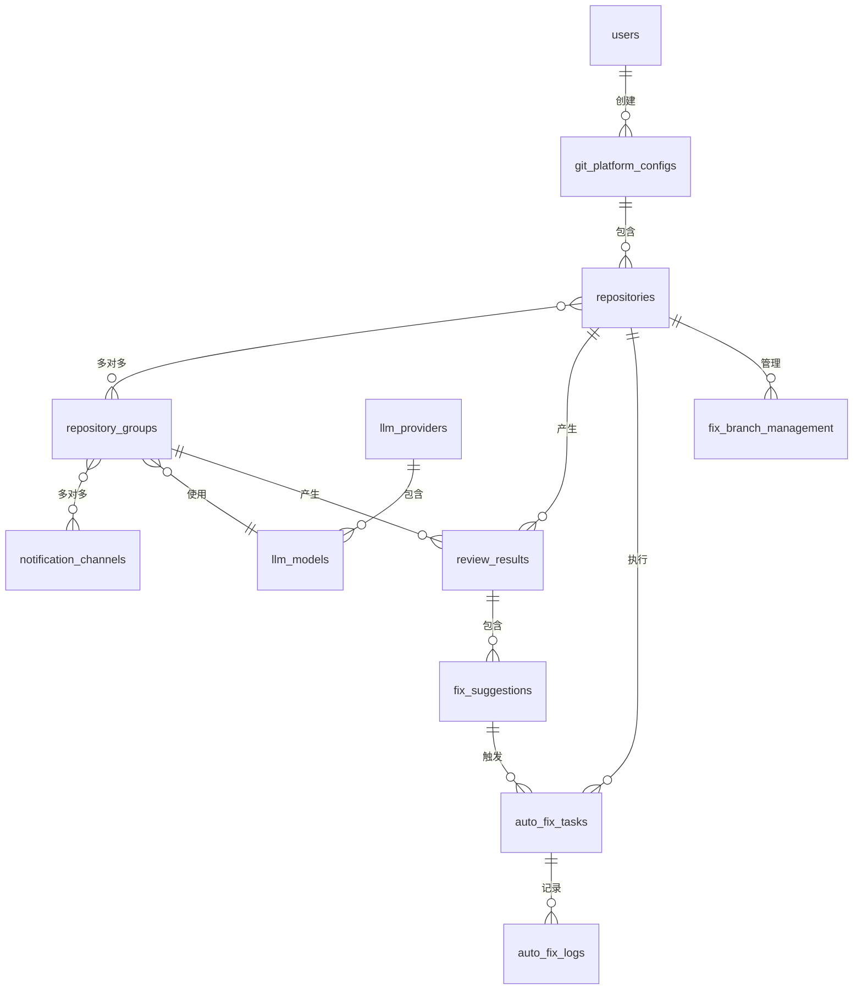

# 数据模型设计

## 1. 数据库选型与支持

### 1.1 双数据库支持方案

- **SQLite**: 开发/测试环境，单机部署
- **MySQL**: 生产环境，分布式部署

### 1.2 GORM 模型设计原则

```go
// 通用模型结构
type BaseModel struct {
    ID        uint           `gorm:"primarykey" json:"id"`
    CreatedAt time.Time      `json:"created_at"`
    UpdatedAt time.Time      `json:"updated_at"`
    DeletedAt gorm.DeletedAt `gorm:"index" json:"-"` // 软删除
}
```

---

## 2. 核心数据模型

### 2.1 用户与认证 (User & Auth)

#### 2.1.1 users - 用户表

```go
type User struct {
    BaseModel
    Username     string `gorm:"uniqueIndex;size:50;not null" json:"username"`
    Password     string `gorm:"size:255;not null" json:"-"` // bcrypt加密
    Nickname     string `gorm:"size:100" json:"nickname"`
    Email        string `gorm:"size:100" json:"email"`
    Avatar       string `gorm:"size:500" json:"avatar"`
    Role         string `gorm:"size:20;default:'user'" json:"role"` // admin, user
    IsActive     bool   `gorm:"default:true" json:"is_active"`
    LastLoginAt  *time.Time `json:"last_login_at"`
}
```

**字段说明:**

- `Username`: 登录用户名，唯一索引
- `Password`: bcrypt 加密后的密码
- `Role`: 角色 (admin 管理员, user 普通用户)
- `IsActive`: 账号是否激活

**索引:**

- `idx_users_username` (UNIQUE)
- `idx_users_deleted_at`

---

### 2.2 Git 平台配置 (Platform)

#### 2.2.1 git_platform_configs - Git 平台配置表

```go
type GitPlatformConfig struct {
    BaseModel
    Name         string `gorm:"size:100;not null" json:"name"`
    PlatformType string `gorm:"size:20;not null;index" json:"platform_type"` // gitlab, github, gitea
    BaseURL      string `gorm:"size:500;not null" json:"base_url"`
    AccessToken  string `gorm:"size:500;not null" json:"access_token"` // 加密存储
    IsActive     bool   `gorm:"default:true" json:"is_active"`

    // 关联
    Repositories []Repository `gorm:"foreignKey:PlatformConfigID" json:"repositories,omitempty"`
}
```

**字段说明:**

- `Name`: 配置名称，如"公司 GitLab"
- `PlatformType`: 平台类型 (gitlab/github/gitea)
- `BaseURL`: 平台地址
- `AccessToken`: 访问令牌（AES 加密存储）
- `IsActive`: 是否启用

**唯一约束:**

```sql
UNIQUE INDEX idx_platform_type_url (platform_type, base_url)
```

---

### 2.3 代码仓库 (Repository)

#### 2.3.1 repositories - 代码仓库表

```go
type Repository struct {
    BaseModel
    PlatformConfigID uint   `gorm:"not null;index" json:"platform_config_id"`
    RepoID           string `gorm:"size:100;not null" json:"repo_id"` // 平台仓库ID
    RepoName         string `gorm:"size:200;not null" json:"repo_name"`
    RepoFullPath     string `gorm:"size:500;not null" json:"repo_full_path"` // group/project
    RepoURL          string `gorm:"size:500;not null" json:"repo_url"`
    DefaultBranch    string `gorm:"size:100;default:'main'" json:"default_branch"`

    // Webhook配置
    WebhookID       *string `gorm:"size:100" json:"webhook_id"`
    WebhookURL      *string `gorm:"size:500" json:"webhook_url"`
    IsWebhookActive bool    `gorm:"default:false" json:"is_webhook_active"`

    // 关联
    PlatformConfig *GitPlatformConfig     `gorm:"foreignKey:PlatformConfigID" json:"platform_config,omitempty"`
    Groups         []RepositoryGroup      `gorm:"many2many:repository_group_mappings;" json:"groups,omitempty"`
    ReviewResults  []ReviewResult         `gorm:"foreignKey:RepositoryID" json:"review_results,omitempty"`
}
```

**字段说明:**

- `RepoID`: 仓库在 Git 平台的 ID
- `RepoFullPath`: 完整路径 (如 `group/subgroup/project`)
- `WebhookID`: Webhook 在 Git 平台的 ID
- `IsWebhookActive`: Webhook 是否已配置

**唯一约束:**

```sql
UNIQUE INDEX idx_repo_platform_id (platform_config_id, repo_id)
```

---

### 2.4 仓库组 (Repository Group)

#### 2.4.1 repository_groups - 仓库组表

```go
type RepositoryGroup struct {
    BaseModel
    Name               string  `gorm:"uniqueIndex;size:100;not null" json:"name"`
    Description        string  `gorm:"size:500" json:"description"`
    LLMModelID         *uint   `gorm:"index" json:"llm_model_id"` // 专属LLM模型
    PromptTemplate     *string `gorm:"type:text" json:"prompt_template"` // JSON格式
    NotificationConfig *string `gorm:"type:text" json:"notification_config"` // JSON格式

    // 关联
    LLMModel             *LLMModel                      `gorm:"foreignKey:LLMModelID" json:"llm_model,omitempty"`
    Repositories         []Repository                   `gorm:"many2many:repository_group_mappings;" json:"repositories,omitempty"`
    NotificationChannels []NotificationChannel          `gorm:"many2many:group_notification_mappings;" json:"notification_channels,omitempty"`
}
```

**字段说明:**

- `PromptTemplate`: 自定义提示词模板 (JSON)
  ```json
  {
    "system_prompt": "你是一个资深的{{language}}代码审查专家...",
    "user_prompt": "请审查以下代码:\n{{diffs}}"
  }
  ```
- `NotificationConfig`: 通知配置 (JSON)
  ```json
  {
    "show_commits": true,
    "show_score": true,
    "show_suggestions": true
  }
  ```

#### 2.4.2 repository_group_mappings - 仓库组关联表

```go
type RepositoryGroupMapping struct {
    ID             uint      `gorm:"primarykey"`
    GroupID        uint      `gorm:"not null;index:idx_group_repo,priority:1"`
    RepositoryID   uint      `gorm:"not null;index:idx_group_repo,priority:2"`
    CreatedAt      time.Time
}
```

**唯一约束:**

```sql
UNIQUE INDEX idx_group_repo (group_id, repository_id)
```

---

### 2.5 LLM 配置 (LLM Provider & Model)

#### 2.5.1 llm_providers - LLM 供应商表

```go
type LLMProvider struct {
    BaseModel
    Name         string `gorm:"size:100;not null" json:"name"`
    ProviderType string `gorm:"size:50;not null;index" json:"provider_type"` // deepseek, openai, zhipuai, qwen, ollama
    APIKey       string `gorm:"size:500" json:"api_key"` // 加密存储
    APIBaseURL   string `gorm:"size:500" json:"api_base_url"`
    IsActive     bool   `gorm:"default:true" json:"is_active"`

    // 关联
    Models []LLMModel `gorm:"foreignKey:ProviderID" json:"models,omitempty"`
}
```

#### 2.5.2 llm_models - LLM 模型表

```go
type LLMModel struct {
    BaseModel
    ProviderID       uint   `gorm:"not null;index" json:"provider_id"`
    ModelName        string `gorm:"size:100;not null" json:"model_name"`
    ModelDisplayName string `gorm:"size:200" json:"model_display_name"`
    MaxTokens        int    `gorm:"default:10000" json:"max_tokens"`
    IsActive         bool   `gorm:"default:true" json:"is_active"`
    IsFromAPI        bool   `gorm:"default:false" json:"is_from_api"` // 是否来自API动态获取

    // 关联
    Provider *LLMProvider `gorm:"foreignKey:ProviderID" json:"provider,omitempty"`
}
```

**唯一约束:**

```sql
UNIQUE INDEX idx_provider_model (provider_id, model_name)
```

---

### 2.6 通知渠道 (Notification Channel)

#### 2.6.1 notification_channels - 通知渠道表

```go
type NotificationChannel struct {
    BaseModel
    Name        string  `gorm:"size:100;not null" json:"name"`
    ChannelType string  `gorm:"size:50;not null" json:"channel_type"` // dingtalk, wecom, feishu, webhook
    WebhookURL  string  `gorm:"size:500;not null" json:"webhook_url"`
    Secret      *string `gorm:"size:500" json:"secret"` // 签名密钥
    ConfigJSON  *string `gorm:"type:text" json:"config_json"` // 额外配置
    IsActive    bool    `gorm:"default:true" json:"is_active"`

    // 关联
    Groups []RepositoryGroup `gorm:"many2many:group_notification_mappings;" json:"groups,omitempty"`
}
```

#### 2.6.2 group_notification_mappings - 仓库组通知关联表

```go
type GroupNotificationMapping struct {
    ID        uint      `gorm:"primarykey"`
    GroupID   uint      `gorm:"not null;index:idx_group_channel,priority:1"`
    ChannelID uint      `gorm:"not null;index:idx_group_channel,priority:2"`
    CreatedAt time.Time
}
```

---

### 2.7 Review 记录 (Review Result)

#### 2.7.1 review_results - Review 结果表

```go
type ReviewResult struct {
    BaseModel
    ReviewType   string `gorm:"size:20;not null;index" json:"review_type"` // mr, push
    RepositoryID uint   `gorm:"not null;index" json:"repository_id"`
    GroupID      *uint  `gorm:"index" json:"group_id"`
    LLMModelID   *uint  `json:"llm_model_id"`

    // 基础信息
    Author       string `gorm:"size:100" json:"author"`
    SourceBranch string `gorm:"size:200" json:"source_branch"`
    TargetBranch string `gorm:"size:200" json:"target_branch"`
    MRURL        string `gorm:"size:500" json:"mr_url"`

    // Commit信息
    CommitMessages string `gorm:"type:text" json:"commit_messages"`
    LastCommitID   string `gorm:"size:100;index" json:"last_commit_id"`
    Additions      int    `gorm:"default:0" json:"additions"`
    Deletions      int    `gorm:"default:0" json:"deletions"`

    // Review结果
    RawResult        string `gorm:"type:longtext" json:"raw_result"`
    StructuredResult string `gorm:"type:text" json:"structured_result"` // JSON格式
    OverallScore     int    `gorm:"default:0" json:"overall_score"`
    Summary          string `gorm:"type:text" json:"summary"`

    // 关联
    Repository  *Repository      `gorm:"foreignKey:RepositoryID" json:"repository,omitempty"`
    Group       *RepositoryGroup `gorm:"foreignKey:GroupID" json:"group,omitempty"`
    LLMModel    *LLMModel        `gorm:"foreignKey:LLMModelID" json:"llm_model,omitempty"`
    Suggestions []FixSuggestion  `gorm:"foreignKey:ReviewResultID" json:"suggestions,omitempty"`
}
```

**字段说明:**

- `ReviewType`: 类型 (mr=Merge Request, push=Push Event)
- `StructuredResult`: 结构化结果 (JSON)
  ```json
  {
    "overall_score": 85,
    "summary": "代码质量良好",
    "suggestions": [...]
  }
  ```

**索引:**

- `idx_review_results_repo_commit` (repository_id, last_commit_id)
- `idx_review_results_created_at` (created_at DESC)

---

### 2.8 修复建议 (Fix Suggestion)

#### 2.8.1 fix_suggestions - 修复建议表

```go
type FixSuggestion struct {
    BaseModel
    ReviewResultID uint   `gorm:"not null;index" json:"review_result_id"`
    FilePath       string `gorm:"size:500;not null" json:"file_path"`
    LineStart      *int   `json:"line_start"`
    LineEnd        *int   `json:"line_end"`
    IssueType      string `gorm:"size:100" json:"issue_type"` // performance, security, style, logic
    Severity       string `gorm:"size:20;default:'medium'" json:"severity"` // critical, high, medium, low
    Description    string `gorm:"type:text;not null" json:"description"`
    Suggestion     string `gorm:"type:text;not null" json:"suggestion"`
    CodeSnippet    string `gorm:"type:text" json:"code_snippet"`

    // 关联
    ReviewResult *ReviewResult `gorm:"foreignKey:ReviewResultID" json:"review_result,omitempty"`
    FixTasks     []AutoFixTask `gorm:"foreignKey:SuggestionID" json:"fix_tasks,omitempty"`
}
```

---

### 2.9 自动修复任务 (Auto Fix Task)

#### 2.9.1 auto_fix_tasks - 自动修复任务表

```go
type AutoFixTask struct {
    BaseModel
    SuggestionID     uint   `gorm:"not null;index" json:"suggestion_id"`
    RepositoryID     uint   `gorm:"not null;index" json:"repository_id"`
    BaseBranch       string `gorm:"size:200;not null" json:"base_branch"`
    FixBranch        string `gorm:"size:200;not null" json:"fix_branch"`
    Status           string `gorm:"size:20;not null;index;default:'pending'" json:"status"` // pending, running, success, failed, cancelled

    // 执行结果
    FixCommitSHA     *string `gorm:"size:100" json:"fix_commit_sha"`
    FixCommitMessage *string `gorm:"type:text" json:"fix_commit_message"`
    ErrorMessage     *string `gorm:"type:text" json:"error_message"`
    ExecutionLog     *string `gorm:"type:longtext" json:"execution_log"`

    // 忽略配置 (需求20)
    IsIgnored       bool    `gorm:"default:false" json:"is_ignored"`
    IgnoreCategory  *string `gorm:"size:100" json:"ignore_category"` // auto-fix, manual-review

    // 时间戳
    StartedAt   *time.Time `json:"started_at"`
    CompletedAt *time.Time `json:"completed_at"`

    // 关联
    Suggestion *FixSuggestion `gorm:"foreignKey:SuggestionID" json:"suggestion,omitempty"`
    Repository *Repository    `gorm:"foreignKey:RepositoryID" json:"repository,omitempty"`
    Logs       []AutoFixLog   `gorm:"foreignKey:TaskID" json:"logs,omitempty"`
}
```

**状态流转:**

```
pending -> running -> success
                   -> failed
                   -> cancelled
```

#### 2.9.2 auto_fix_logs - 自动修复日志表

```go
type AutoFixLog struct {
    ID        uint      `gorm:"primarykey"`
    TaskID    uint      `gorm:"not null;index:idx_task_logs"`
    LogLevel  string    `gorm:"size:20;not null"` // info, warning, error, debug
    Message   string    `gorm:"type:text;not null"`
    Timestamp time.Time `gorm:"not null;index:idx_task_logs"`

    // 关联
    Task *AutoFixTask `gorm:"foreignKey:TaskID" json:"task,omitempty"`
}
```

**索引:**

```sql
INDEX idx_task_logs (task_id, timestamp DESC)
```

---

### 2.10 修复分支管理 (Fix Branch Management)

#### 2.10.1 fix_branch_management - 修复分支管理表

```go
type FixBranchManagement struct {
    BaseModel
    RepositoryID  uint   `gorm:"not null;index" json:"repository_id"`
    BranchName    string `gorm:"size:200;not null" json:"branch_name"`
    BaseBranch    string `gorm:"size:200;not null" json:"base_branch"`
    RelatedMRURL  string `gorm:"size:500" json:"related_mr_url"` // 关联的MR/PR URL
    IsMerged      bool   `gorm:"default:false" json:"is_merged"`
    IsDeleted     bool   `gorm:"default:false" json:"is_deleted"`

    // 关联
    Repository *Repository `gorm:"foreignKey:RepositoryID" json:"repository,omitempty"`
}
```

**唯一约束:**

```sql
UNIQUE INDEX idx_repo_branch (repository_id, branch_name)
```

---

### 2.11 系统配置 (System Config)

#### 2.11.1 system_configs - 系统配置表

```go
type SystemConfig struct {
    ID          uint      `gorm:"primarykey"`
    ConfigKey   string    `gorm:"uniqueIndex;size:100;not null"`
    ConfigValue string    `gorm:"type:text"`
    ConfigType  string    `gorm:"size:20;default:'string'"` // string, json, boolean, integer
    Description string    `gorm:"size:500"`
    UpdatedAt   time.Time
}
```

**预置配置:**

```go
var DefaultConfigs = []SystemConfig{
    {ConfigKey: "webhook_base_url", ConfigValue: "http://localhost:8080", ConfigType: "string", Description: "Webhook回调基础URL"},
    {ConfigKey: "default_fix_branch_prefix", ConfigValue: "ai-fix/", ConfigType: "string", Description: "自动修复分支前缀"},
    {ConfigKey: "snow_cli_path", ConfigValue: "snow", ConfigType: "string", Description: "Snow-CLI命令路径"},
    {ConfigKey: "clone_base_path", ConfigValue: "/tmp/handsoff-workspace", ConfigType: "string", Description: "代码克隆基础路径"},
    {ConfigKey: "max_concurrent_fix_tasks", ConfigValue: "3", ConfigType: "integer", Description: "最大并发修复任务数"},
    {ConfigKey: "notification_show_commits", ConfigValue: "true", ConfigType: "boolean", Description: "通知中是否展示commit信息"},
    {ConfigKey: "notification_show_score", ConfigValue: "true", ConfigType: "boolean", Description: "通知中是否展示评分"},
}
```

---

## 3. 数据库关系图



---

## 4. SQL 迁移文件

### 4.1 初始化迁移 (000001_init_schema.up.sql)

```sql
-- 用户表
CREATE TABLE IF NOT EXISTS users (
    id BIGINT AUTO_INCREMENT PRIMARY KEY,
    username VARCHAR(50) NOT NULL UNIQUE,
    password VARCHAR(255) NOT NULL,
    nickname VARCHAR(100),
    email VARCHAR(100),
    avatar VARCHAR(500),
    role VARCHAR(20) DEFAULT 'user',
    is_active BOOLEAN DEFAULT TRUE,
    last_login_at TIMESTAMP NULL,
    created_at TIMESTAMP DEFAULT CURRENT_TIMESTAMP,
    updated_at TIMESTAMP DEFAULT CURRENT_TIMESTAMP ON UPDATE CURRENT_TIMESTAMP,
    deleted_at TIMESTAMP NULL,
    INDEX idx_users_deleted_at (deleted_at)
) ENGINE=InnoDB DEFAULT CHARSET=utf8mb4 COLLATE=utf8mb4_unicode_ci;

-- Git平台配置表
CREATE TABLE IF NOT EXISTS git_platform_configs (
    id BIGINT AUTO_INCREMENT PRIMARY KEY,
    name VARCHAR(100) NOT NULL,
    platform_type VARCHAR(20) NOT NULL,
    base_url VARCHAR(500) NOT NULL,
    access_token VARCHAR(500) NOT NULL,
    is_active BOOLEAN DEFAULT TRUE,
    created_at TIMESTAMP DEFAULT CURRENT_TIMESTAMP,
    updated_at TIMESTAMP DEFAULT CURRENT_TIMESTAMP ON UPDATE CURRENT_TIMESTAMP,
    deleted_at TIMESTAMP NULL,
    UNIQUE INDEX idx_platform_type_url (platform_type, base_url),
    INDEX idx_platform_type (platform_type),
    INDEX idx_deleted_at (deleted_at)
) ENGINE=InnoDB DEFAULT CHARSET=utf8mb4 COLLATE=utf8mb4_unicode_ci;

-- 仓库表
CREATE TABLE IF NOT EXISTS repositories (
    id BIGINT AUTO_INCREMENT PRIMARY KEY,
    platform_config_id BIGINT NOT NULL,
    repo_id VARCHAR(100) NOT NULL,
    repo_name VARCHAR(200) NOT NULL,
    repo_full_path VARCHAR(500) NOT NULL,
    repo_url VARCHAR(500) NOT NULL,
    default_branch VARCHAR(100) DEFAULT 'main',
    webhook_id VARCHAR(100),
    webhook_url VARCHAR(500),
    is_webhook_active BOOLEAN DEFAULT FALSE,
    created_at TIMESTAMP DEFAULT CURRENT_TIMESTAMP,
    updated_at TIMESTAMP DEFAULT CURRENT_TIMESTAMP ON UPDATE CURRENT_TIMESTAMP,
    deleted_at TIMESTAMP NULL,
    UNIQUE INDEX idx_repo_platform_id (platform_config_id, repo_id),
    INDEX idx_platform_config (platform_config_id),
    INDEX idx_deleted_at (deleted_at),
    FOREIGN KEY (platform_config_id) REFERENCES git_platform_configs(id) ON DELETE CASCADE
) ENGINE=InnoDB DEFAULT CHARSET=utf8mb4 COLLATE=utf8mb4_unicode_ci;

-- 仓库组表
CREATE TABLE IF NOT EXISTS repository_groups (
    id BIGINT AUTO_INCREMENT PRIMARY KEY,
    name VARCHAR(100) NOT NULL UNIQUE,
    description VARCHAR(500),
    llm_model_id BIGINT,
    prompt_template TEXT,
    notification_config TEXT,
    created_at TIMESTAMP DEFAULT CURRENT_TIMESTAMP,
    updated_at TIMESTAMP DEFAULT CURRENT_TIMESTAMP ON UPDATE CURRENT_TIMESTAMP,
    deleted_at TIMESTAMP NULL,
    INDEX idx_llm_model (llm_model_id),
    INDEX idx_deleted_at (deleted_at)
) ENGINE=InnoDB DEFAULT CHARSET=utf8mb4 COLLATE=utf8mb4_unicode_ci;

-- 仓库组关联表
CREATE TABLE IF NOT EXISTS repository_group_mappings (
    id BIGINT AUTO_INCREMENT PRIMARY KEY,
    group_id BIGINT NOT NULL,
    repository_id BIGINT NOT NULL,
    created_at TIMESTAMP DEFAULT CURRENT_TIMESTAMP,
    UNIQUE INDEX idx_group_repo (group_id, repository_id),
    FOREIGN KEY (group_id) REFERENCES repository_groups(id) ON DELETE CASCADE,
    FOREIGN KEY (repository_id) REFERENCES repositories(id) ON DELETE CASCADE
) ENGINE=InnoDB DEFAULT CHARSET=utf8mb4 COLLATE=utf8mb4_unicode_ci;

-- LLM供应商表
CREATE TABLE IF NOT EXISTS llm_providers (
    id BIGINT AUTO_INCREMENT PRIMARY KEY,
    name VARCHAR(100) NOT NULL,
    provider_type VARCHAR(50) NOT NULL,
    api_key VARCHAR(500),
    api_base_url VARCHAR(500),
    is_active BOOLEAN DEFAULT TRUE,
    created_at TIMESTAMP DEFAULT CURRENT_TIMESTAMP,
    updated_at TIMESTAMP DEFAULT CURRENT_TIMESTAMP ON UPDATE CURRENT_TIMESTAMP,
    deleted_at TIMESTAMP NULL,
    INDEX idx_provider_type (provider_type),
    INDEX idx_deleted_at (deleted_at)
) ENGINE=InnoDB DEFAULT CHARSET=utf8mb4 COLLATE=utf8mb4_unicode_ci;

-- LLM模型表
CREATE TABLE IF NOT EXISTS llm_models (
    id BIGINT AUTO_INCREMENT PRIMARY KEY,
    provider_id BIGINT NOT NULL,
    model_name VARCHAR(100) NOT NULL,
    model_display_name VARCHAR(200),
    max_tokens INT DEFAULT 10000,
    is_active BOOLEAN DEFAULT TRUE,
    is_from_api BOOLEAN DEFAULT FALSE,
    created_at TIMESTAMP DEFAULT CURRENT_TIMESTAMP,
    updated_at TIMESTAMP DEFAULT CURRENT_TIMESTAMP ON UPDATE CURRENT_TIMESTAMP,
    deleted_at TIMESTAMP NULL,
    UNIQUE INDEX idx_provider_model (provider_id, model_name),
    INDEX idx_provider (provider_id),
    INDEX idx_deleted_at (deleted_at),
    FOREIGN KEY (provider_id) REFERENCES llm_providers(id) ON DELETE CASCADE
) ENGINE=InnoDB DEFAULT CHARSET=utf8mb4 COLLATE=utf8mb4_unicode_ci;

-- 通知渠道表
CREATE TABLE IF NOT EXISTS notification_channels (
    id BIGINT AUTO_INCREMENT PRIMARY KEY,
    name VARCHAR(100) NOT NULL,
    channel_type VARCHAR(50) NOT NULL,
    webhook_url VARCHAR(500) NOT NULL,
    secret VARCHAR(500),
    config_json TEXT,
    is_active BOOLEAN DEFAULT TRUE,
    created_at TIMESTAMP DEFAULT CURRENT_TIMESTAMP,
    updated_at TIMESTAMP DEFAULT CURRENT_TIMESTAMP ON UPDATE CURRENT_TIMESTAMP,
    deleted_at TIMESTAMP NULL,
    INDEX idx_deleted_at (deleted_at)
) ENGINE=InnoDB DEFAULT CHARSET=utf8mb4 COLLATE=utf8mb4_unicode_ci;

-- 仓库组通知关联表
CREATE TABLE IF NOT EXISTS group_notification_mappings (
    id BIGINT AUTO_INCREMENT PRIMARY KEY,
    group_id BIGINT NOT NULL,
    channel_id BIGINT NOT NULL,
    created_at TIMESTAMP DEFAULT CURRENT_TIMESTAMP,
    UNIQUE INDEX idx_group_channel (group_id, channel_id),
    FOREIGN KEY (group_id) REFERENCES repository_groups(id) ON DELETE CASCADE,
    FOREIGN KEY (channel_id) REFERENCES notification_channels(id) ON DELETE CASCADE
) ENGINE=InnoDB DEFAULT CHARSET=utf8mb4 COLLATE=utf8mb4_unicode_ci;

-- Review结果表
CREATE TABLE IF NOT EXISTS review_results (
    id BIGINT AUTO_INCREMENT PRIMARY KEY,
    review_type VARCHAR(20) NOT NULL,
    repository_id BIGINT NOT NULL,
    group_id BIGINT,
    llm_model_id BIGINT,
    author VARCHAR(100),
    source_branch VARCHAR(200),
    target_branch VARCHAR(200),
    mr_url VARCHAR(500),
    commit_messages TEXT,
    last_commit_id VARCHAR(100),
    additions INT DEFAULT 0,
    deletions INT DEFAULT 0,
    raw_result LONGTEXT,
    structured_result TEXT,
    overall_score INT DEFAULT 0,
    summary TEXT,
    created_at TIMESTAMP DEFAULT CURRENT_TIMESTAMP,
    updated_at TIMESTAMP DEFAULT CURRENT_TIMESTAMP ON UPDATE CURRENT_TIMESTAMP,
    deleted_at TIMESTAMP NULL,
    INDEX idx_review_type (review_type),
    INDEX idx_repository (repository_id),
    INDEX idx_repo_commit (repository_id, last_commit_id),
    INDEX idx_created_at (created_at DESC),
    INDEX idx_deleted_at (deleted_at),
    FOREIGN KEY (repository_id) REFERENCES repositories(id) ON DELETE CASCADE
) ENGINE=InnoDB DEFAULT CHARSET=utf8mb4 COLLATE=utf8mb4_unicode_ci;

-- 修复建议表
CREATE TABLE IF NOT EXISTS fix_suggestions (
    id BIGINT AUTO_INCREMENT PRIMARY KEY,
    review_result_id BIGINT NOT NULL,
    file_path VARCHAR(500) NOT NULL,
    line_start INT,
    line_end INT,
    issue_type VARCHAR(100),
    severity VARCHAR(20) DEFAULT 'medium',
    description TEXT NOT NULL,
    suggestion TEXT NOT NULL,
    code_snippet TEXT,
    created_at TIMESTAMP DEFAULT CURRENT_TIMESTAMP,
    updated_at TIMESTAMP DEFAULT CURRENT_TIMESTAMP ON UPDATE CURRENT_TIMESTAMP,
    deleted_at TIMESTAMP NULL,
    INDEX idx_review_result (review_result_id),
    INDEX idx_deleted_at (deleted_at),
    FOREIGN KEY (review_result_id) REFERENCES review_results(id) ON DELETE CASCADE
) ENGINE=InnoDB DEFAULT CHARSET=utf8mb4 COLLATE=utf8mb4_unicode_ci;

-- 自动修复任务表
CREATE TABLE IF NOT EXISTS auto_fix_tasks (
    id BIGINT AUTO_INCREMENT PRIMARY KEY,
    suggestion_id BIGINT NOT NULL,
    repository_id BIGINT NOT NULL,
    base_branch VARCHAR(200) NOT NULL,
    fix_branch VARCHAR(200) NOT NULL,
    status VARCHAR(20) NOT NULL DEFAULT 'pending',
    fix_commit_sha VARCHAR(100),
    fix_commit_message TEXT,
    error_message TEXT,
    execution_log LONGTEXT,
    is_ignored BOOLEAN DEFAULT FALSE,
    ignore_category VARCHAR(100),
    started_at TIMESTAMP NULL,
    completed_at TIMESTAMP NULL,
    created_at TIMESTAMP DEFAULT CURRENT_TIMESTAMP,
    updated_at TIMESTAMP DEFAULT CURRENT_TIMESTAMP ON UPDATE CURRENT_TIMESTAMP,
    deleted_at TIMESTAMP NULL,
    INDEX idx_suggestion (suggestion_id),
    INDEX idx_repository (repository_id),
    INDEX idx_status (status),
    INDEX idx_deleted_at (deleted_at),
    FOREIGN KEY (suggestion_id) REFERENCES fix_suggestions(id) ON DELETE CASCADE,
    FOREIGN KEY (repository_id) REFERENCES repositories(id) ON DELETE CASCADE
) ENGINE=InnoDB DEFAULT CHARSET=utf8mb4 COLLATE=utf8mb4_unicode_ci;

-- 自动修复日志表
CREATE TABLE IF NOT EXISTS auto_fix_logs (
    id BIGINT AUTO_INCREMENT PRIMARY KEY,
    task_id BIGINT NOT NULL,
    log_level VARCHAR(20) NOT NULL,
    message TEXT NOT NULL,
    timestamp TIMESTAMP DEFAULT CURRENT_TIMESTAMP,
    INDEX idx_task_logs (task_id, timestamp DESC),
    FOREIGN KEY (task_id) REFERENCES auto_fix_tasks(id) ON DELETE CASCADE
) ENGINE=InnoDB DEFAULT CHARSET=utf8mb4 COLLATE=utf8mb4_unicode_ci;

-- 修复分支管理表
CREATE TABLE IF NOT EXISTS fix_branch_management (
    id BIGINT AUTO_INCREMENT PRIMARY KEY,
    repository_id BIGINT NOT NULL,
    branch_name VARCHAR(200) NOT NULL,
    base_branch VARCHAR(200) NOT NULL,
    related_mr_url VARCHAR(500),
    is_merged BOOLEAN DEFAULT FALSE,
    is_deleted BOOLEAN DEFAULT FALSE,
    created_at TIMESTAMP DEFAULT CURRENT_TIMESTAMP,
    updated_at TIMESTAMP DEFAULT CURRENT_TIMESTAMP ON UPDATE CURRENT_TIMESTAMP,
    deleted_at TIMESTAMP NULL,
    UNIQUE INDEX idx_repo_branch (repository_id, branch_name),
    INDEX idx_repository (repository_id),
    INDEX idx_deleted_at (deleted_at),
    FOREIGN KEY (repository_id) REFERENCES repositories(id) ON DELETE CASCADE
) ENGINE=InnoDB DEFAULT CHARSET=utf8mb4 COLLATE=utf8mb4_unicode_ci;

-- 系统配置表
CREATE TABLE IF NOT EXISTS system_configs (
    id BIGINT AUTO_INCREMENT PRIMARY KEY,
    config_key VARCHAR(100) NOT NULL UNIQUE,
    config_value TEXT,
    config_type VARCHAR(20) DEFAULT 'string',
    description VARCHAR(500),
    updated_at TIMESTAMP DEFAULT CURRENT_TIMESTAMP ON UPDATE CURRENT_TIMESTAMP
) ENGINE=InnoDB DEFAULT CHARSET=utf8mb4 COLLATE=utf8mb4_unicode_ci;

-- 插入默认系统配置
INSERT INTO system_configs (config_key, config_value, config_type, description) VALUES
('webhook_base_url', 'http://localhost:8080', 'string', 'Webhook回调基础URL'),
('default_fix_branch_prefix', 'ai-fix/', 'string', '自动修复分支前缀'),
('snow_cli_path', 'snow', 'string', 'Snow-CLI命令路径'),
('clone_base_path', '/tmp/handsoff-workspace', 'string', '代码克隆基础路径'),
('max_concurrent_fix_tasks', '3', 'integer', '最大并发修复任务数'),
('notification_show_commits', 'true', 'boolean', '通知中是否展示commit信息'),
('notification_show_score', 'true', 'boolean', '通知中是否展示评分');
```

### 4.2 SQLite 适配说明

```sql
-- SQLite版本的差异:
-- 1. BIGINT -> INTEGER
-- 2. LONGTEXT -> TEXT
-- 3. ON UPDATE CURRENT_TIMESTAMP -> 触发器实现
-- 4. ENGINE=InnoDB -> 移除

-- SQLite更新时间触发器示例:
CREATE TRIGGER update_users_updated_at
AFTER UPDATE ON users
BEGIN
    UPDATE users SET updated_at = CURRENT_TIMESTAMP WHERE id = NEW.id;
END;
```

---

## 5. 数据模型总结

### 5.1 核心表格 (15 张)

1. ✅ users - 用户表
2. ✅ git_platform_configs - Git 平台配置
3. ✅ repositories - 代码仓库
4. ✅ repository_groups - 仓库组
5. ✅ repository_group_mappings - 仓库组关联
6. ✅ llm_providers - LLM 供应商
7. ✅ llm_models - LLM 模型
8. ✅ notification_channels - 通知渠道
9. ✅ group_notification_mappings - 通知关联
10. ✅ review_results - Review 结果
11. ✅ fix_suggestions - 修复建议
12. ✅ auto_fix_tasks - 自动修复任务
13. ✅ auto_fix_logs - 修复日志
14. ✅ fix_branch_management - 分支管理
15. ✅ system_configs - 系统配置

### 5.2 关键特性

- ✅ 软删除支持 (DeletedAt 字段)
- ✅ 双数据库兼容 (SQLite/MySQL)
- ✅ 完整的外键约束
- ✅ 合理的索引设计
- ✅ 支持 25 项需求的所有字段

---

**下一步**: 功能清单梳理
