# MVP 功能关系图

## 1. 系统架构图

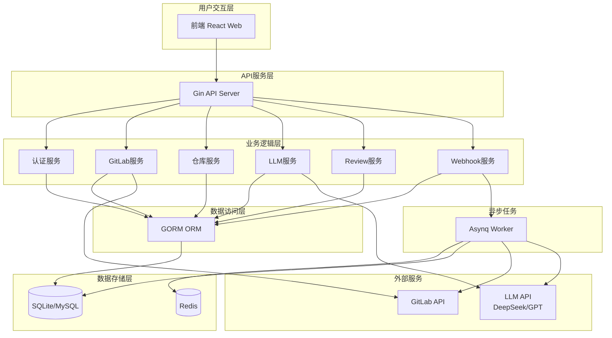

---

## 2. 核心功能模块关系图

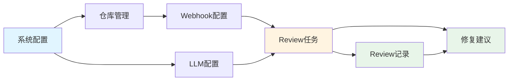

### 模块说明

| 模块 | 职责 | 依赖 |
|------|------|------|
| 系统配置 | GitLab配置、LLM配置、提示词模板 | 无 |
| 仓库管理 | 导入仓库、配置仓库LLM | 系统配置 |
| Webhook配置 | 配置GitLab Webhook | 仓库管理 |
| Review任务 | 触发AI审查、执行审查 | Webhook、LLM配置 |
| Review记录 | 存储审查结果 | Review任务 |
| 修复建议 | 存储修复建议 | Review记录 |

---

## 3. 用户操作流程图

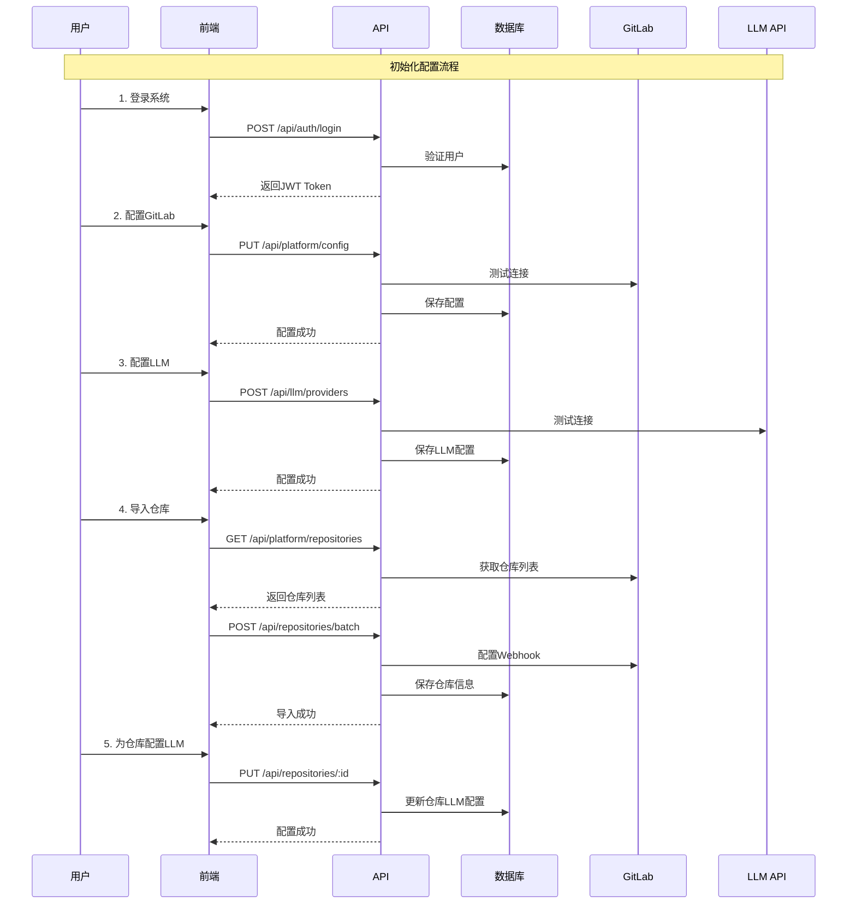

---

## 4. Webhook触发Review流程图

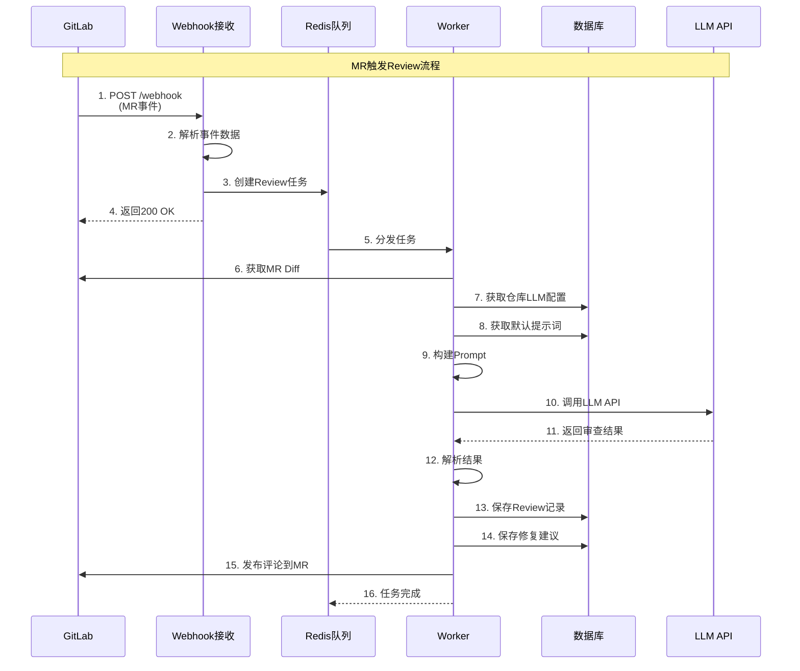

---

## 5. 数据流图

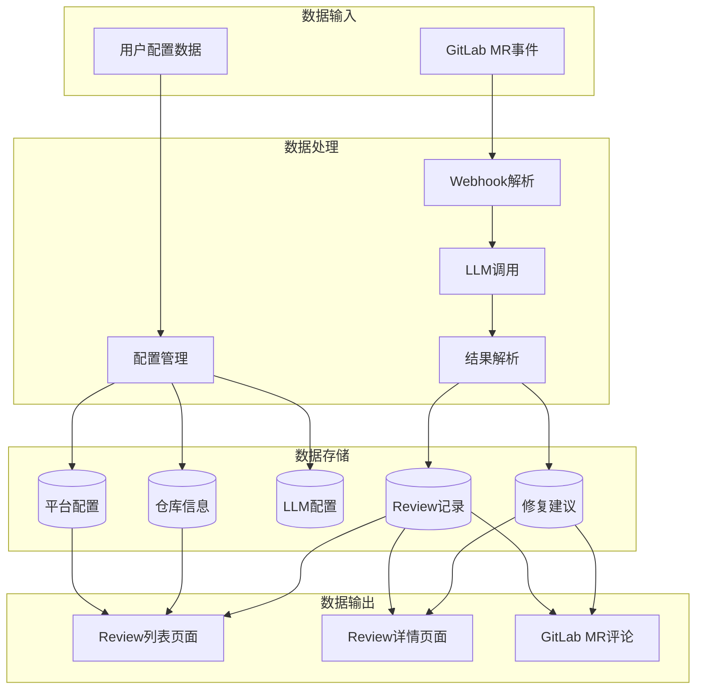

---

## 6. 页面导航关系图

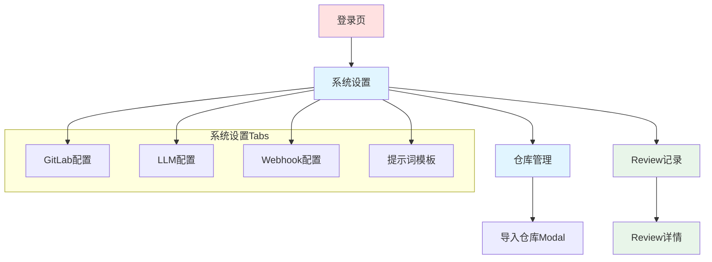

---

## 7. API接口关系图

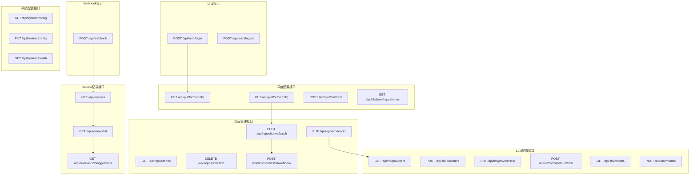

---

## 8. 状态管理关系图（前端）

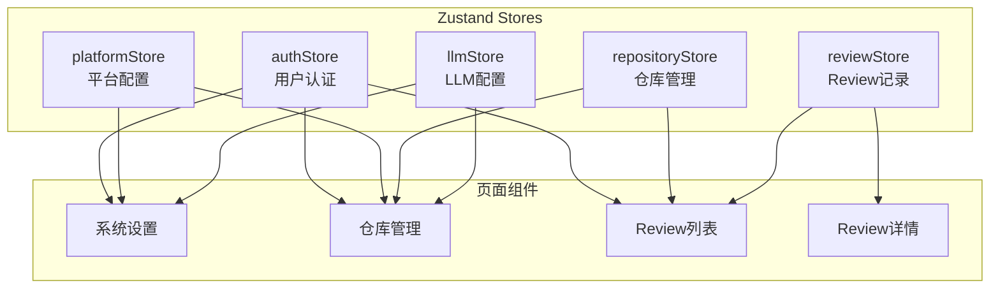

---

## 9. 数据库表关系图（MVP简化版）

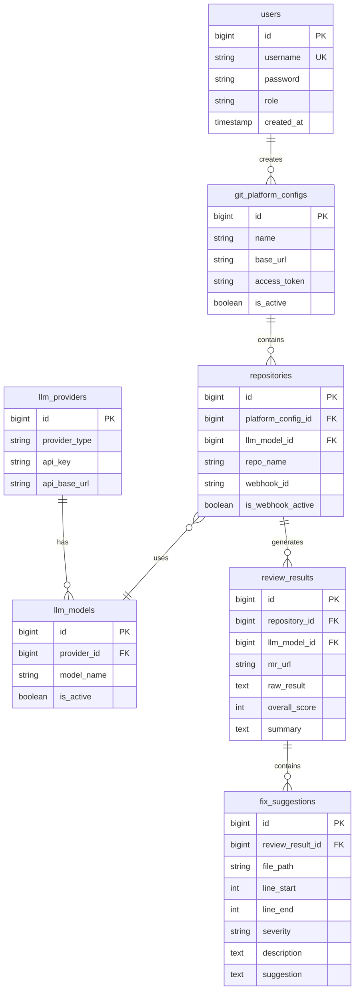

---

## 10. 技术栈关系图

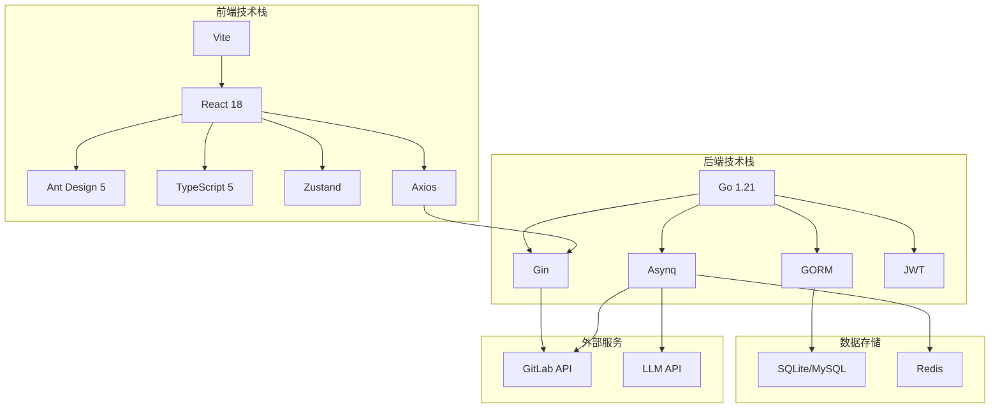

---

## 11. 功能优先级矩阵

```mermaid
quadrantChart
    title MVP功能优先级矩阵
    x-axis 低实现难度 --> 高实现难度
    y-axis 低业务价值 --> 高业务价值
    quadrant-1 高价值高难度（后续）
    quadrant-2 高价值低难度（MVP）
    quadrant-3 低价值低难度（可选）
    quadrant-4 低价值高难度（放弃）
    
    用户登录: [0.2, 0.9]
    GitLab配置: [0.3, 0.95]
    仓库导入: [0.4, 0.9]
    Webhook配置: [0.5, 0.85]
    LLM配置: [0.4, 0.95]
    Review记录: [0.5, 1.0]
    修复建议: [0.6, 0.9]
    自动修复: [0.9, 0.8]
    仓库组: [0.6, 0.4]
    通知渠道: [0.5, 0.5]
    Dashboard: [0.4, 0.3]
    多平台支持: [0.7, 0.6]
```

**说明**:
- **象限2（左上）**: MVP核心功能，优先实现
- **象限1（右上）**: 高价值但复杂，后续版本实现
- **象限3（左下）**: 低优先级，可选
- **象限4（右下）**: 暂不实现

---

## 12. 开发阶段关系图

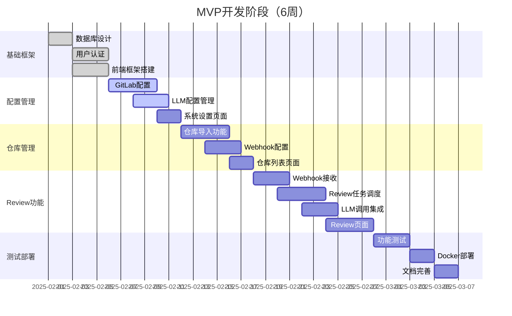

---

## 总结

本文档通过12个关系图全面展示了MVP版本的：

1. ✅ **系统架构**: 展示整体分层结构
2. ✅ **功能模块**: 展示模块间依赖关系
3. ✅ **用户流程**: 展示用户操作全流程
4. ✅ **Review流程**: 展示核心业务流程
5. ✅ **数据流**: 展示数据流转过程
6. ✅ **页面导航**: 展示前端页面结构
7. ✅ **API关系**: 展示接口调用关系
8. ✅ **状态管理**: 展示前端状态设计
9. ✅ **数据模型**: 展示表结构关系
10. ✅ **技术栈**: 展示技术选型关系
11. ✅ **优先级矩阵**: 展示功能价值分析
12. ✅ **开发阶段**: 展示实施计划

这些关系图能够帮助团队快速理解MVP的整体设计和实施路径。
