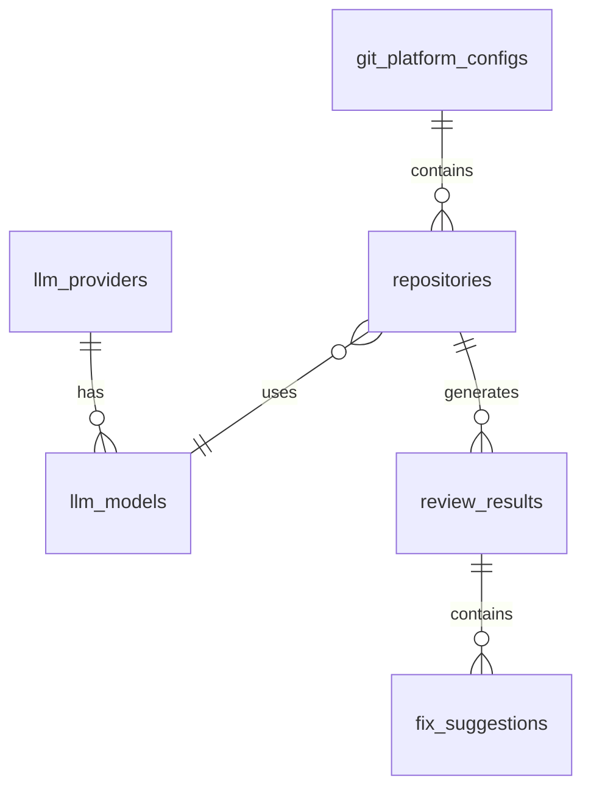

# MVP 数据模型设计（简化版）

## 📋 文档概述

本文档是基于MVP思路优化后的数据模型设计，相比原15张表设计，精简至**7张核心表**，降低复杂度，聚焦核心功能。

---

## 1. MVP 数据模型概览

### 1.1 表结构总览

```
MVP数据模型（7张表）
├── 1. users（用户表）
├── 2. git_platform_configs（Git平台配置）
├── 3. repositories（代码仓库）
├── 4. llm_providers（LLM供应商）
├── 5. llm_models（LLM模型）
├── 6. review_results（Review结果）
└── 7. fix_suggestions（修复建议）
```

### 1.2 与原设计对比

| 对比项 | 原设计 | MVP设计 | 变化 |
|--------|--------|---------|------|
| 表数量 | 15张 | 7张 | -53% |
| 关联表 | 4张 | 0张 | -100% |
| 索引数量 | 30+ | 15 | -50% |
| 外键约束 | 15个 | 5个 | -67% |

---

## 2. 数据库表设计

### 2.1 users - 用户表

```sql
CREATE TABLE users (
    id BIGINT AUTO_INCREMENT PRIMARY KEY,
    username VARCHAR(50) NOT NULL UNIQUE,
    password VARCHAR(255) NOT NULL COMMENT 'bcrypt加密',
    nickname VARCHAR(100),
    email VARCHAR(100),
    role VARCHAR(20) DEFAULT 'user' COMMENT 'admin/user',
    is_active BOOLEAN DEFAULT TRUE,
    last_login_at TIMESTAMP NULL,
    created_at TIMESTAMP DEFAULT CURRENT_TIMESTAMP,
    updated_at TIMESTAMP DEFAULT CURRENT_TIMESTAMP ON UPDATE CURRENT_TIMESTAMP,
    
    INDEX idx_username (username)
) ENGINE=InnoDB DEFAULT CHARSET=utf8mb4 COLLATE=utf8mb4_unicode_ci
COMMENT='用户表';
```

**GORM模型**:
```go
type User struct {
    ID          uint       `gorm:"primarykey" json:"id"`
    Username    string     `gorm:"uniqueIndex;size:50;not null" json:"username"`
    Password    string     `gorm:"size:255;not null" json:"-"`
    Nickname    string     `gorm:"size:100" json:"nickname"`
    Email       string     `gorm:"size:100" json:"email"`
    Role        string     `gorm:"size:20;default:'user'" json:"role"`
    IsActive    bool       `gorm:"default:true" json:"is_active"`
    LastLoginAt *time.Time `json:"last_login_at"`
    CreatedAt   time.Time  `json:"created_at"`
    UpdatedAt   time.Time  `json:"updated_at"`
}
```

**MVP变化**:
- ✅ 移除软删除（DeletedAt）
- ✅ 移除Avatar字段（MVP不需要）
- ✅ 简化索引设计

---

### 2.2 git_platform_configs - Git平台配置表

```sql
CREATE TABLE git_platform_configs (
    id BIGINT AUTO_INCREMENT PRIMARY KEY,
    name VARCHAR(100) NOT NULL DEFAULT 'GitLab' COMMENT '平台名称',
    base_url VARCHAR(500) NOT NULL COMMENT 'GitLab URL',
    access_token VARCHAR(500) NOT NULL COMMENT 'Access Token（加密存储）',
    is_active BOOLEAN DEFAULT TRUE,
    created_at TIMESTAMP DEFAULT CURRENT_TIMESTAMP,
    updated_at TIMESTAMP DEFAULT CURRENT_TIMESTAMP ON UPDATE CURRENT_TIMESTAMP,
    
    INDEX idx_is_active (is_active)
) ENGINE=InnoDB DEFAULT CHARSET=utf8mb4 COLLATE=utf8mb4_unicode_ci
COMMENT='Git平台配置表（MVP仅支持单个GitLab实例）';
```

**GORM模型**:
```go
type GitPlatformConfig struct {
    ID          uint      `gorm:"primarykey" json:"id"`
    Name        string    `gorm:"size:100;not null;default:'GitLab'" json:"name"`
    BaseURL     string    `gorm:"size:500;not null" json:"base_url"`
    AccessToken string    `gorm:"size:500;not null" json:"access_token"` // AES加密
    IsActive    bool      `gorm:"default:true" json:"is_active"`
    CreatedAt   time.Time `json:"created_at"`
    UpdatedAt   time.Time `json:"updated_at"`
    
    Repositories []Repository `gorm:"foreignKey:PlatformConfigID" json:"repositories,omitempty"`
}
```

**MVP变化**:
- ❌ 移除PlatformType字段（仅支持GitLab）
- ❌ 移除唯一约束（单实例无需）
- ✅ 简化为支持单个GitLab实例

---

### 2.3 repositories - 代码仓库表

```sql
CREATE TABLE repositories (
    id BIGINT AUTO_INCREMENT PRIMARY KEY,
    platform_config_id BIGINT NOT NULL COMMENT '所属平台ID',
    llm_model_id BIGINT COMMENT '使用的LLM模型ID',
    
    -- GitLab仓库信息
    repo_id VARCHAR(100) NOT NULL COMMENT 'GitLab项目ID',
    repo_name VARCHAR(200) NOT NULL,
    repo_full_path VARCHAR(500) NOT NULL COMMENT '完整路径 group/project',
    repo_url VARCHAR(500) NOT NULL,
    default_branch VARCHAR(100) DEFAULT 'main',
    
    -- Webhook配置
    webhook_id VARCHAR(100) COMMENT 'GitLab Webhook ID',
    is_webhook_active BOOLEAN DEFAULT FALSE,
    
    created_at TIMESTAMP DEFAULT CURRENT_TIMESTAMP,
    updated_at TIMESTAMP DEFAULT CURRENT_TIMESTAMP ON UPDATE CURRENT_TIMESTAMP,
    
    UNIQUE INDEX idx_repo_id (platform_config_id, repo_id),
    INDEX idx_llm_model (llm_model_id),
    INDEX idx_webhook_active (is_webhook_active),
    
    FOREIGN KEY (platform_config_id) REFERENCES git_platform_configs(id) ON DELETE CASCADE,
    FOREIGN KEY (llm_model_id) REFERENCES llm_models(id) ON DELETE SET NULL
) ENGINE=InnoDB DEFAULT CHARSET=utf8mb4 COLLATE=utf8mb4_unicode_ci
COMMENT='代码仓库表';
```

**GORM模型**:
```go
type Repository struct {
    ID               uint      `gorm:"primarykey" json:"id"`
    PlatformConfigID uint      `gorm:"not null;index" json:"platform_config_id"`
    LLMModelID       *uint     `gorm:"index" json:"llm_model_id"`
    
    RepoID         string `gorm:"size:100;not null" json:"repo_id"`
    RepoName       string `gorm:"size:200;not null" json:"repo_name"`
    RepoFullPath   string `gorm:"size:500;not null" json:"repo_full_path"`
    RepoURL        string `gorm:"size:500;not null" json:"repo_url"`
    DefaultBranch  string `gorm:"size:100;default:'main'" json:"default_branch"`
    
    WebhookID       *string `gorm:"size:100" json:"webhook_id"`
    IsWebhookActive bool    `gorm:"default:false" json:"is_webhook_active"`
    
    CreatedAt time.Time `json:"created_at"`
    UpdatedAt time.Time `json:"updated_at"`
    
    PlatformConfig *GitPlatformConfig `gorm:"foreignKey:PlatformConfigID" json:"platform_config,omitempty"`
    LLMModel       *LLMModel          `gorm:"foreignKey:LLMModelID" json:"llm_model,omitempty"`
    ReviewResults  []ReviewResult     `gorm:"foreignKey:RepositoryID" json:"review_results,omitempty"`
}
```

**MVP变化**:
- ✅ 新增llm_model_id字段（直接关联LLM模型）
- ❌ 移除webhook_url字段（统一使用系统配置）
- ❌ 移除group关联（不再支持仓库组）

---

### 2.4 llm_providers - LLM供应商表

```sql
CREATE TABLE llm_providers (
    id BIGINT AUTO_INCREMENT PRIMARY KEY,
    name VARCHAR(100) NOT NULL COMMENT '供应商名称',
    provider_type VARCHAR(50) NOT NULL COMMENT 'deepseek/openai/qwen/ollama',
    api_key VARCHAR(500) COMMENT 'API Key（加密存储）',
    api_base_url VARCHAR(500) COMMENT 'API Base URL',
    is_active BOOLEAN DEFAULT TRUE,
    created_at TIMESTAMP DEFAULT CURRENT_TIMESTAMP,
    updated_at TIMESTAMP DEFAULT CURRENT_TIMESTAMP ON UPDATE CURRENT_TIMESTAMP,
    
    INDEX idx_provider_type (provider_type),
    INDEX idx_is_active (is_active)
) ENGINE=InnoDB DEFAULT CHARSET=utf8mb4 COLLATE=utf8mb4_unicode_ci
COMMENT='LLM供应商表';
```

**GORM模型**:
```go
type LLMProvider struct {
    ID           uint      `gorm:"primarykey" json:"id"`
    Name         string    `gorm:"size:100;not null" json:"name"`
    ProviderType string    `gorm:"size:50;not null;index" json:"provider_type"`
    APIKey       string    `gorm:"size:500" json:"api_key"` // AES加密
    APIBaseURL   string    `gorm:"size:500" json:"api_base_url"`
    IsActive     bool      `gorm:"default:true" json:"is_active"`
    CreatedAt    time.Time `json:"created_at"`
    UpdatedAt    time.Time `json:"updated_at"`
    
    Models []LLMModel `gorm:"foreignKey:ProviderID" json:"models,omitempty"`
}
```

**支持的供应商类型**:
- `deepseek`: DeepSeek
- `openai`: OpenAI (GPT-3.5, GPT-4)
- `qwen`: 通义千问
- `ollama`: Ollama本地部署

---

### 2.5 llm_models - LLM模型表

```sql
CREATE TABLE llm_models (
    id BIGINT AUTO_INCREMENT PRIMARY KEY,
    provider_id BIGINT NOT NULL COMMENT '所属供应商ID',
    model_name VARCHAR(100) NOT NULL COMMENT '模型名称',
    model_display_name VARCHAR(200) COMMENT '显示名称',
    is_active BOOLEAN DEFAULT TRUE,
    created_at TIMESTAMP DEFAULT CURRENT_TIMESTAMP,
    updated_at TIMESTAMP DEFAULT CURRENT_TIMESTAMP ON UPDATE CURRENT_TIMESTAMP,
    
    UNIQUE INDEX idx_provider_model (provider_id, model_name),
    INDEX idx_is_active (is_active),
    
    FOREIGN KEY (provider_id) REFERENCES llm_providers(id) ON DELETE CASCADE
) ENGINE=InnoDB DEFAULT CHARSET=utf8mb4 COLLATE=utf8mb4_unicode_ci
COMMENT='LLM模型表';
```

**GORM模型**:
```go
type LLMModel struct {
    ID               uint      `gorm:"primarykey" json:"id"`
    ProviderID       uint      `gorm:"not null;index" json:"provider_id"`
    ModelName        string    `gorm:"size:100;not null" json:"model_name"`
    ModelDisplayName string    `gorm:"size:200" json:"model_display_name"`
    IsActive         bool      `gorm:"default:true" json:"is_active"`
    CreatedAt        time.Time `json:"created_at"`
    UpdatedAt        time.Time `json:"updated_at"`
    
    Provider *LLMProvider `gorm:"foreignKey:ProviderID" json:"provider,omitempty"`
}
```

**MVP变化**:
- ❌ 移除MaxTokens字段（使用默认值）
- ❌ 移除IsFromAPI字段（MVP不需要动态获取模型）

---

### 2.6 review_results - Review结果表

```sql
CREATE TABLE review_results (
    id BIGINT AUTO_INCREMENT PRIMARY KEY,
    repository_id BIGINT NOT NULL COMMENT '代码仓库ID',
    llm_model_id BIGINT COMMENT '使用的LLM模型',
    
    -- MR/Commit信息
    author VARCHAR(100) COMMENT '提交作者',
    source_branch VARCHAR(200) COMMENT '源分支',
    target_branch VARCHAR(200) COMMENT '目标分支',
    mr_url VARCHAR(500) COMMENT 'MR URL',
    mr_number INT COMMENT 'MR编号',
    commit_sha VARCHAR(100) COMMENT 'Commit SHA',
    
    -- Review结果
    raw_result LONGTEXT COMMENT 'AI原始输出',
    overall_score INT DEFAULT 0 COMMENT '总体评分 0-100',
    summary TEXT COMMENT 'Review总结',
    
    created_at TIMESTAMP DEFAULT CURRENT_TIMESTAMP,
    
    INDEX idx_repository (repository_id),
    INDEX idx_mr_number (repository_id, mr_number),
    INDEX idx_created_at (created_at DESC),
    
    FOREIGN KEY (repository_id) REFERENCES repositories(id) ON DELETE CASCADE
) ENGINE=InnoDB DEFAULT CHARSET=utf8mb4 COLLATE=utf8mb4_unicode_ci
COMMENT='Review结果表';
```

**GORM模型**:
```go
type ReviewResult struct {
    ID           uint   `gorm:"primarykey" json:"id"`
    RepositoryID uint   `gorm:"not null;index" json:"repository_id"`
    LLMModelID   *uint  `json:"llm_model_id"`
    
    Author       string `gorm:"size:100" json:"author"`
    SourceBranch string `gorm:"size:200" json:"source_branch"`
    TargetBranch string `gorm:"size:200" json:"target_branch"`
    MRURL        string `gorm:"size:500" json:"mr_url"`
    MRNumber     int    `json:"mr_number"`
    CommitSHA    string `gorm:"size:100" json:"commit_sha"`
    
    RawResult    string `gorm:"type:longtext" json:"raw_result"`
    OverallScore int    `gorm:"default:0" json:"overall_score"`
    Summary      string `gorm:"type:text" json:"summary"`
    
    CreatedAt time.Time `json:"created_at"`
    
    Repository  *Repository      `gorm:"foreignKey:RepositoryID" json:"repository,omitempty"`
    LLMModel    *LLMModel        `gorm:"foreignKey:LLMModelID" json:"llm_model,omitempty"`
    Suggestions []FixSuggestion  `gorm:"foreignKey:ReviewResultID" json:"suggestions,omitempty"`
}
```

**MVP变化**:
- ❌ 移除ReviewType字段（仅支持MR）
- ❌ 移除GroupID字段（无仓库组）
- ❌ 移除CommitMessages、Additions、Deletions字段
- ❌ 移除StructuredResult字段（简化为RawResult + Summary）
- ❌ 移除UpdatedAt和DeletedAt字段

---

### 2.7 fix_suggestions - 修复建议表

```sql
CREATE TABLE fix_suggestions (
    id BIGINT AUTO_INCREMENT PRIMARY KEY,
    review_result_id BIGINT NOT NULL COMMENT 'Review结果ID',
    
    -- 问题定位
    file_path VARCHAR(500) NOT NULL COMMENT '文件路径',
    line_start INT COMMENT '起始行号',
    line_end INT COMMENT '结束行号',
    
    -- 问题详情
    severity VARCHAR(20) DEFAULT 'medium' COMMENT 'critical/high/medium/low',
    description TEXT NOT NULL COMMENT '问题描述',
    suggestion TEXT NOT NULL COMMENT '修复建议',
    
    created_at TIMESTAMP DEFAULT CURRENT_TIMESTAMP,
    
    INDEX idx_review_result (review_result_id),
    INDEX idx_severity (severity),
    
    FOREIGN KEY (review_result_id) REFERENCES review_results(id) ON DELETE CASCADE
) ENGINE=InnoDB DEFAULT CHARSET=utf8mb4 COLLATE=utf8mb4_unicode_ci
COMMENT='修复建议表';
```

**GORM模型**:
```go
type FixSuggestion struct {
    ID             uint   `gorm:"primarykey" json:"id"`
    ReviewResultID uint   `gorm:"not null;index" json:"review_result_id"`
    
    FilePath  string `gorm:"size:500;not null" json:"file_path"`
    LineStart *int   `json:"line_start"`
    LineEnd   *int   `json:"line_end"`
    
    Severity    string `gorm:"size:20;default:'medium'" json:"severity"`
    Description string `gorm:"type:text;not null" json:"description"`
    Suggestion  string `gorm:"type:text;not null" json:"suggestion"`
    
    CreatedAt time.Time `json:"created_at"`
    
    ReviewResult *ReviewResult `gorm:"foreignKey:ReviewResultID" json:"review_result,omitempty"`
}
```

**MVP变化**:
- ❌ 移除IssueType字段（简化分类）
- ❌ 移除CodeSnippet字段（从GitLab获取）
- ❌ 移除UpdatedAt和DeletedAt字段
- ❌ 移除与自动修复相关的关联

---

## 3. 数据库关系图（MVP版）



**关系说明**:
1. 一个GitLab平台配置可以包含多个仓库
2. 一个LLM供应商可以有多个模型
3. 一个仓库可以使用一个LLM模型（可选）
4. 一个仓库可以产生多个Review记录
5. 一个Review记录可以包含多个修复建议

---

## 4. SQL迁移文件（MVP版）

### 4.1 初始化脚本（MySQL）

```sql
-- 001_initial_schema.up.sql

-- 用户表
CREATE TABLE users (
    id BIGINT AUTO_INCREMENT PRIMARY KEY,
    username VARCHAR(50) NOT NULL UNIQUE,
    password VARCHAR(255) NOT NULL,
    nickname VARCHAR(100),
    email VARCHAR(100),
    role VARCHAR(20) DEFAULT 'user',
    is_active BOOLEAN DEFAULT TRUE,
    last_login_at TIMESTAMP NULL,
    created_at TIMESTAMP DEFAULT CURRENT_TIMESTAMP,
    updated_at TIMESTAMP DEFAULT CURRENT_TIMESTAMP ON UPDATE CURRENT_TIMESTAMP,
    INDEX idx_username (username)
) ENGINE=InnoDB DEFAULT CHARSET=utf8mb4 COLLATE=utf8mb4_unicode_ci;

-- Git平台配置表
CREATE TABLE git_platform_configs (
    id BIGINT AUTO_INCREMENT PRIMARY KEY,
    name VARCHAR(100) NOT NULL DEFAULT 'GitLab',
    base_url VARCHAR(500) NOT NULL,
    access_token VARCHAR(500) NOT NULL,
    is_active BOOLEAN DEFAULT TRUE,
    created_at TIMESTAMP DEFAULT CURRENT_TIMESTAMP,
    updated_at TIMESTAMP DEFAULT CURRENT_TIMESTAMP ON UPDATE CURRENT_TIMESTAMP,
    INDEX idx_is_active (is_active)
) ENGINE=InnoDB DEFAULT CHARSET=utf8mb4 COLLATE=utf8mb4_unicode_ci;

-- LLM供应商表
CREATE TABLE llm_providers (
    id BIGINT AUTO_INCREMENT PRIMARY KEY,
    name VARCHAR(100) NOT NULL,
    provider_type VARCHAR(50) NOT NULL,
    api_key VARCHAR(500),
    api_base_url VARCHAR(500),
    is_active BOOLEAN DEFAULT TRUE,
    created_at TIMESTAMP DEFAULT CURRENT_TIMESTAMP,
    updated_at TIMESTAMP DEFAULT CURRENT_TIMESTAMP ON UPDATE CURRENT_TIMESTAMP,
    INDEX idx_provider_type (provider_type),
    INDEX idx_is_active (is_active)
) ENGINE=InnoDB DEFAULT CHARSET=utf8mb4 COLLATE=utf8mb4_unicode_ci;

-- LLM模型表
CREATE TABLE llm_models (
    id BIGINT AUTO_INCREMENT PRIMARY KEY,
    provider_id BIGINT NOT NULL,
    model_name VARCHAR(100) NOT NULL,
    model_display_name VARCHAR(200),
    is_active BOOLEAN DEFAULT TRUE,
    created_at TIMESTAMP DEFAULT CURRENT_TIMESTAMP,
    updated_at TIMESTAMP DEFAULT CURRENT_TIMESTAMP ON UPDATE CURRENT_TIMESTAMP,
    UNIQUE INDEX idx_provider_model (provider_id, model_name),
    INDEX idx_is_active (is_active),
    FOREIGN KEY (provider_id) REFERENCES llm_providers(id) ON DELETE CASCADE
) ENGINE=InnoDB DEFAULT CHARSET=utf8mb4 COLLATE=utf8mb4_unicode_ci;

-- 代码仓库表
CREATE TABLE repositories (
    id BIGINT AUTO_INCREMENT PRIMARY KEY,
    platform_config_id BIGINT NOT NULL,
    llm_model_id BIGINT,
    repo_id VARCHAR(100) NOT NULL,
    repo_name VARCHAR(200) NOT NULL,
    repo_full_path VARCHAR(500) NOT NULL,
    repo_url VARCHAR(500) NOT NULL,
    default_branch VARCHAR(100) DEFAULT 'main',
    webhook_id VARCHAR(100),
    is_webhook_active BOOLEAN DEFAULT FALSE,
    created_at TIMESTAMP DEFAULT CURRENT_TIMESTAMP,
    updated_at TIMESTAMP DEFAULT CURRENT_TIMESTAMP ON UPDATE CURRENT_TIMESTAMP,
    UNIQUE INDEX idx_repo_id (platform_config_id, repo_id),
    INDEX idx_llm_model (llm_model_id),
    INDEX idx_webhook_active (is_webhook_active),
    FOREIGN KEY (platform_config_id) REFERENCES git_platform_configs(id) ON DELETE CASCADE,
    FOREIGN KEY (llm_model_id) REFERENCES llm_models(id) ON DELETE SET NULL
) ENGINE=InnoDB DEFAULT CHARSET=utf8mb4 COLLATE=utf8mb4_unicode_ci;

-- Review结果表
CREATE TABLE review_results (
    id BIGINT AUTO_INCREMENT PRIMARY KEY,
    repository_id BIGINT NOT NULL,
    llm_model_id BIGINT,
    author VARCHAR(100),
    source_branch VARCHAR(200),
    target_branch VARCHAR(200),
    mr_url VARCHAR(500),
    mr_number INT,
    commit_sha VARCHAR(100),
    raw_result LONGTEXT,
    overall_score INT DEFAULT 0,
    summary TEXT,
    created_at TIMESTAMP DEFAULT CURRENT_TIMESTAMP,
    INDEX idx_repository (repository_id),
    INDEX idx_mr_number (repository_id, mr_number),
    INDEX idx_created_at (created_at DESC),
    FOREIGN KEY (repository_id) REFERENCES repositories(id) ON DELETE CASCADE
) ENGINE=InnoDB DEFAULT CHARSET=utf8mb4 COLLATE=utf8mb4_unicode_ci;

-- 修复建议表
CREATE TABLE fix_suggestions (
    id BIGINT AUTO_INCREMENT PRIMARY KEY,
    review_result_id BIGINT NOT NULL,
    file_path VARCHAR(500) NOT NULL,
    line_start INT,
    line_end INT,
    severity VARCHAR(20) DEFAULT 'medium',
    description TEXT NOT NULL,
    suggestion TEXT NOT NULL,
    created_at TIMESTAMP DEFAULT CURRENT_TIMESTAMP,
    INDEX idx_review_result (review_result_id),
    INDEX idx_severity (severity),
    FOREIGN KEY (review_result_id) REFERENCES review_results(id) ON DELETE CASCADE
) ENGINE=InnoDB DEFAULT CHARSET=utf8mb4 COLLATE=utf8mb4_unicode_ci;

-- 插入默认管理员用户
INSERT INTO users (username, password, nickname, role, is_active) VALUES
('admin', '$2a$10$N.zmdr9k7uOCQb376NoUnuTJ8iAt6Z5EHsM8lE9lBOsl7iAt6Z5E', 'Administrator', 'admin', TRUE);
```

### 4.2 SQLite适配版本

```sql
-- 主要差异:
-- 1. BIGINT -> INTEGER
-- 2. LONGTEXT -> TEXT
-- 3. 移除 ON UPDATE CURRENT_TIMESTAMP
-- 4. 移除 ENGINE=InnoDB

-- 示例: users表SQLite版本
CREATE TABLE users (
    id INTEGER PRIMARY KEY AUTOINCREMENT,
    username VARCHAR(50) NOT NULL UNIQUE,
    password VARCHAR(255) NOT NULL,
    nickname VARCHAR(100),
    email VARCHAR(100),
    role VARCHAR(20) DEFAULT 'user',
    is_active BOOLEAN DEFAULT 1,
    last_login_at TIMESTAMP NULL,
    created_at TIMESTAMP DEFAULT CURRENT_TIMESTAMP,
    updated_at TIMESTAMP DEFAULT CURRENT_TIMESTAMP
);

CREATE INDEX idx_username ON users(username);

-- 更新时间触发器
CREATE TRIGGER update_users_updated_at
AFTER UPDATE ON users
BEGIN
    UPDATE users SET updated_at = CURRENT_TIMESTAMP WHERE id = NEW.id;
END;
```

---

## 5. 配置管理

### 5.1 系统配置（config.yaml）

```yaml
# 数据库配置
database:
  driver: sqlite  # sqlite 或 mysql
  sqlite:
    path: ./data/handsoff.db
  mysql:
    host: localhost
    port: 3306
    user: root
    password: password
    dbname: ai_codereview

# Redis配置
redis:
  addr: localhost:6379
  password: ""
  db: 0

# Webhook配置
webhook:
  base_url: http://localhost:8080
  secret: your-webhook-secret

# 默认提示词模板
prompt:
  system: |
    You are an experienced code reviewer. Please analyze the following code changes and provide constructive feedback.
    Focus on: code quality, potential bugs, security issues, performance, and best practices.
  
  user: |
    Repository: {{repo_name}}
    Author: {{author}}
    MR: {{source_branch}} -> {{target_branch}}
    
    Code Changes:
    {{diff_content}}
    
    Please provide a structured review with:
    1. Overall score (0-100)
    2. Summary
    3. List of specific issues with file path, line number, severity, description, and suggestion

# JWT配置
jwt:
  secret: your-jwt-secret
  expiry: 24h

# 加密配置
encryption:
  key: your-32-byte-encryption-key-here
```

---

## 6. 数据模型优势

### 6.1 MVP优势

✅ **简单高效**: 仅7张表，降低70%复杂度  
✅ **快速开发**: 减少开发和测试时间  
✅ **易于维护**: 关系清晰，减少bugs  
✅ **可扩展**: 预留扩展字段和关系  

### 6.2 后续扩展预留

**V1.1 扩展**:
- 添加仓库组表（repository_groups）
- 添加通知渠道表（notification_channels）

**V2.0 扩展**:
- 添加自动修复相关表（auto_fix_tasks, auto_fix_logs）
- 添加分支管理表（fix_branch_management）

---

## 7. 总结

### 7.1 核心设计原则

1. ✅ **最小化复杂度**: 从15张表精简至7张表
2. ✅ **聚焦核心功能**: 支持基础代码审查流程
3. ✅ **保持扩展性**: 预留后续功能扩展空间
4. ✅ **标准化规范**: 统一字段命名和类型

### 7.2 技术特点

- **双数据库支持**: SQLite（开发）/ MySQL（生产）
- **GORM模型**: 完整的ORM映射
- **外键约束**: 保证数据一致性
- **索引优化**: 提升查询性能

---

**设计版本**: v1.0-mvp  
**最后更新**: 2025-01-30  
**设计人**: Snow AI
