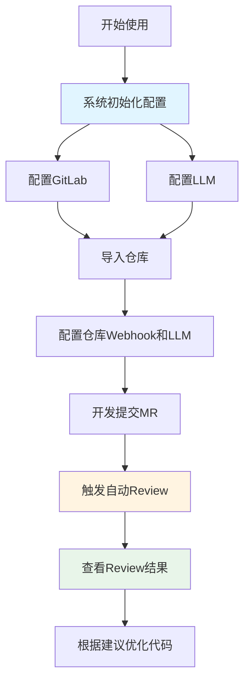
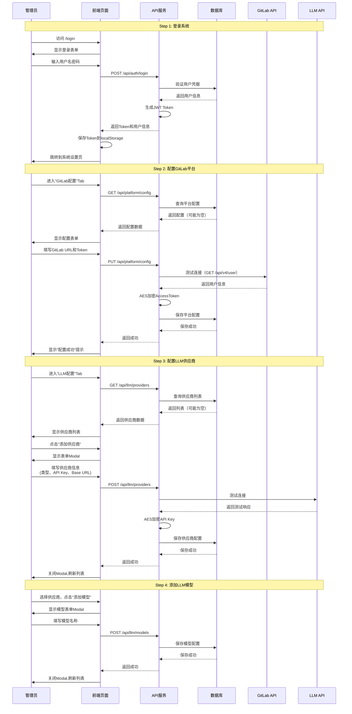
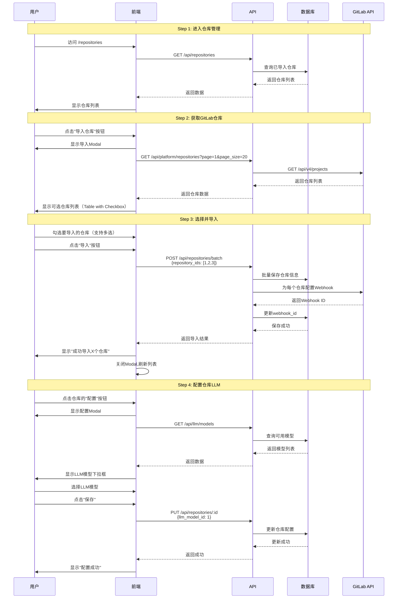
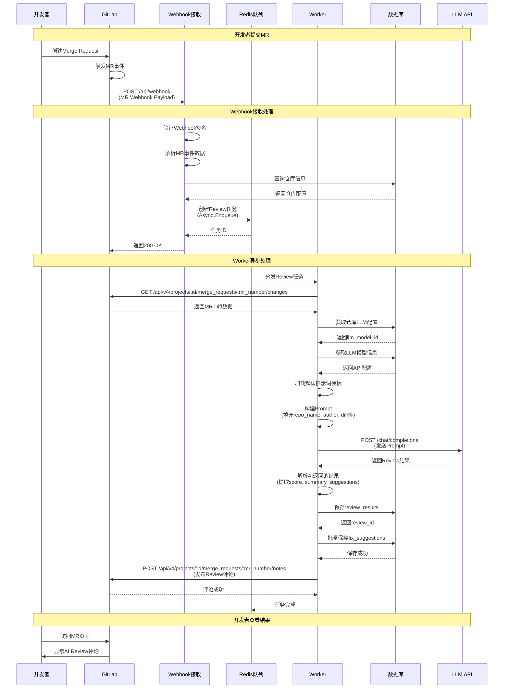
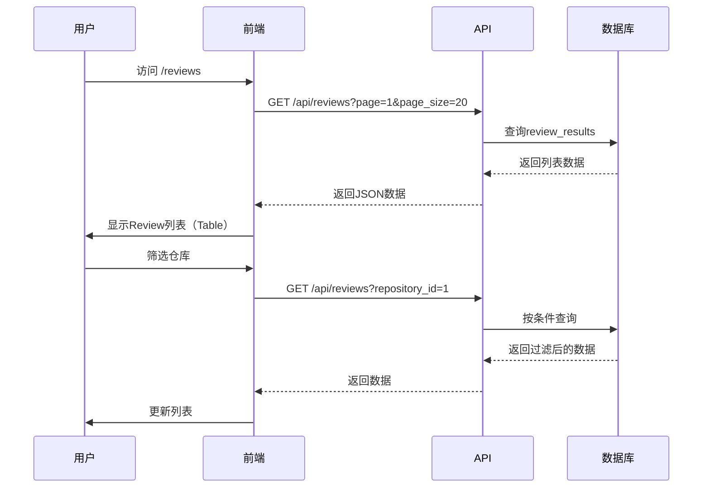
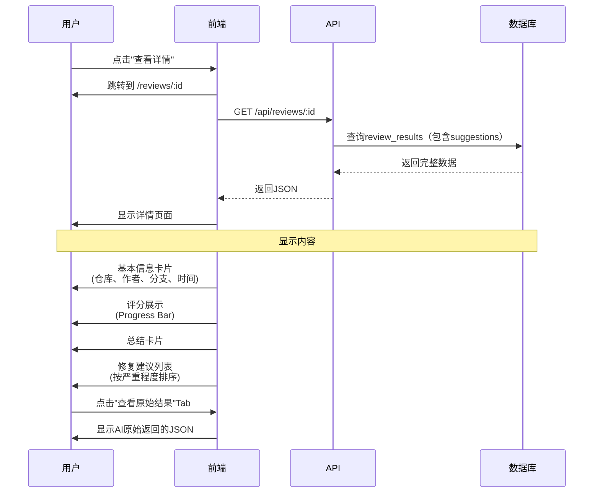
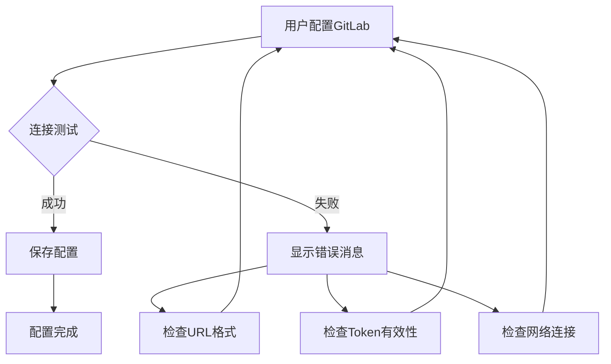
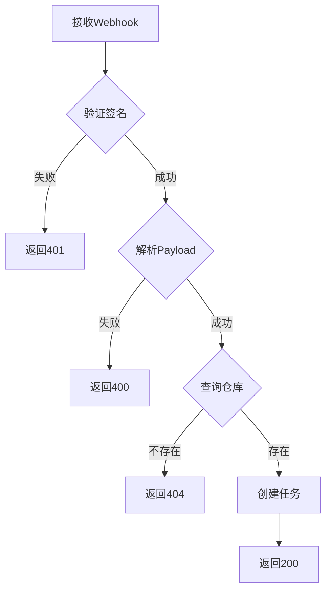
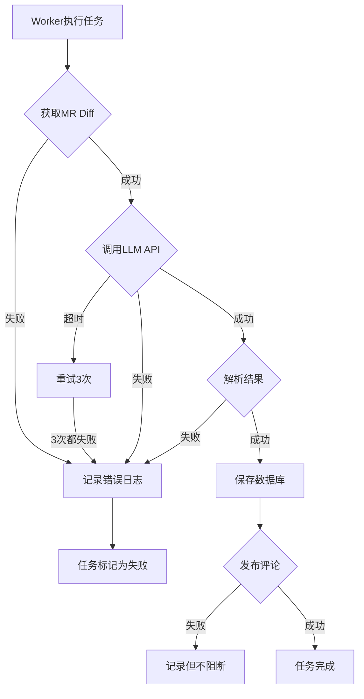
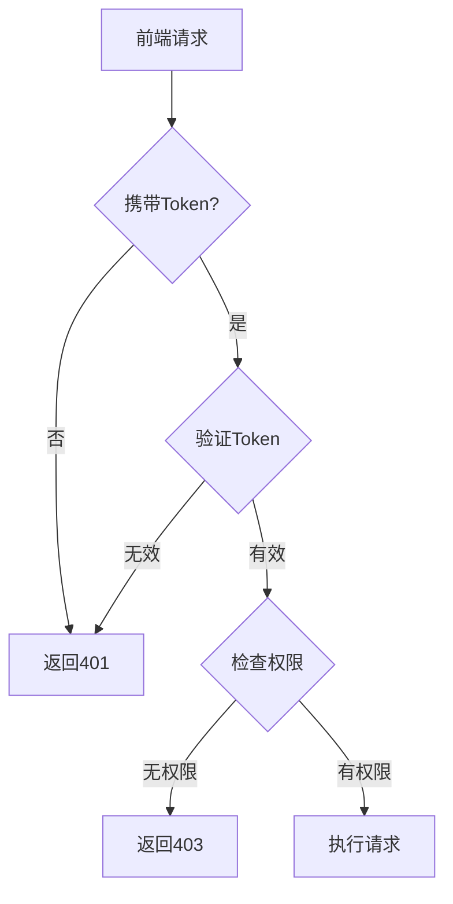

# MVP 交互流程设计

## 📋 文档概述

本文档详细说明MVP版本的核心交互流程，包括用户操作流程、系统处理流程和数据流转设计。

---

## 1. 核心业务流程总览



---

## 2. 用户初始化配置流程

### 2.1 完整配置流程图



### 2.2 配置步骤详解

#### 步骤1: 登录系统

**页面**: `/login`

**操作流程**:
1. 用户输入用户名和密码
2. 点击"登录"按钮
3. 前端验证表单（非空、格式）
4. 发送POST请求到 `/api/auth/login`
5. 后端验证凭据
6. 生成JWT Token（24小时有效期）
7. 返回Token和用户信息
8. 前端保存Token到localStorage
9. 跳转到系统设置页

**默认管理员账号**:
- 用户名: `admin`
- 密码: `admin123`

#### 步骤2: 配置GitLab

**页面**: `/settings` (GitLab配置Tab)

**配置项**:
| 字段 | 说明 | 示例 |
|------|------|------|
| GitLab URL | GitLab实例地址 | `https://gitlab.com` |
| Access Token | 个人访问令牌 | `glpat-xxxxxxxxxxxx` |

**操作流程**:
1. 填写GitLab URL和Access Token
2. 点击"测试连接"按钮（可选）
   - 调用GitLab API `/api/v4/user`
   - 验证Token有效性
   - 显示连接成功/失败消息
3. 点击"保存"按钮
4. 后端加密保存Token
5. 显示保存成功提示

#### 步骤3: 配置LLM供应商

**页面**: `/settings` (LLM配置Tab)

**配置项**:
| 字段 | 说明 | 示例 |
|------|------|------|
| 供应商名称 | 自定义名称 | "DeepSeek生产环境" |
| 供应商类型 | deepseek/openai/qwen/ollama | deepseek |
| API Key | LLM API密钥 | `sk-xxxxxxxx` |
| Base URL | API基础地址 | `https://api.deepseek.com` |

**操作流程**:
1. 点击"添加供应商"按钮
2. 填写供应商信息
3. 点击"测试连接"（可选）
4. 点击"保存"
5. 供应商列表显示新增项

#### 步骤4: 添加LLM模型

**页面**: `/settings` (LLM配置Tab -> 模型管理)

**配置项**:
| 字段 | 说明 | 示例 |
|------|------|------|
| 模型名称 | 模型标识 | `deepseek-chat` |
| 显示名称 | 前端显示 | "DeepSeek Chat" |

**推荐模型**:
- **DeepSeek**: `deepseek-chat`
- **OpenAI**: `gpt-3.5-turbo`
- **Qwen**: `qwen-turbo`

---

## 3. 仓库导入与配置流程

### 3.1 导入仓库流程图



### 3.2 导入步骤详解

#### 步骤1: 查看已导入仓库

**页面**: `/repositories`

**显示内容**:
- 仓库列表（Table）
- 列: 仓库名、完整路径、默认分支、Webhook状态、LLM模型、操作
- 操作按钮: 配置、删除

#### 步骤2: 从GitLab获取仓库

**触发**: 点击"导入仓库"按钮

**显示**: Modal对话框

**内容**:
- 搜索框（可选）
- 仓库列表（带复选框）
- 分页控件
- 批量导入按钮

**GitLab API调用**:
```
GET /api/v4/projects?per_page=20&page=1&owned=true
```

#### 步骤3: 批量导入

**操作**:
1. 勾选要导入的仓库
2. 点击"导入"按钮
3. 后端处理:
   - 保存仓库信息到数据库
   - 为每个仓库配置GitLab Webhook
   - 设置Webhook事件: `merge_request_events`
   - 保存Webhook ID
4. 显示导入结果

**Webhook配置**:
```json
{
  "url": "http://your-server.com/api/webhook",
  "merge_request_events": true,
  "enable_ssl_verification": false
}
```

#### 步骤4: 配置仓库LLM

**操作**:
1. 点击仓库的"配置"按钮
2. 选择LLM模型
3. 保存配置

---

## 4. Webhook触发Review流程

### 4.1 完整Review流程图



### 4.2 Webhook Payload示例

```json
{
  "object_kind": "merge_request",
  "user": {
    "name": "张三",
    "username": "zhangsan"
  },
  "project": {
    "id": 123,
    "name": "my-project",
    "web_url": "https://gitlab.com/group/my-project"
  },
  "object_attributes": {
    "id": 456,
    "iid": 10,
    "title": "feat: add login feature",
    "description": "实现用户登录功能",
    "source_branch": "feature/login",
    "target_branch": "main",
    "state": "opened",
    "action": "open",
    "url": "https://gitlab.com/group/my-project/-/merge_requests/10"
  }
}
```

### 4.3 提示词模板示例

```markdown
You are an experienced code reviewer. Please analyze the following code changes and provide constructive feedback.

**Repository**: {{repo_name}}
**Author**: {{author}}
**Merge Request**: {{source_branch}} -> {{target_branch}}
**MR URL**: {{mr_url}}

**Code Changes**:
```diff
{{diff_content}}
```

Please provide a structured review with:

1. **Overall Score** (0-100): Rate the code quality
2. **Summary**: Brief summary of the code quality
3. **Issues**: List specific issues with:
   - File path
   - Line numbers
   - Severity (critical/high/medium/low)
   - Description
   - Suggestion for improvement

**Output Format** (JSON):
```json
{
  "overall_score": 85,
  "summary": "Code quality is good overall...",
  "suggestions": [
    {
      "file_path": "src/auth.go",
      "line_start": 10,
      "line_end": 15,
      "severity": "high",
      "description": "Password is stored in plain text",
      "suggestion": "Use bcrypt to hash the password"
    }
  ]
}
```

### 4.4 AI返回结果解析

**原始返回**:
```json
{
  "overall_score": 85,
  "summary": "代码整体质量良好，但存在一些安全隐患需要修复...",
  "suggestions": [
    {
      "file_path": "src/login.go",
      "line_start": 25,
      "line_end": 30,
      "severity": "high",
      "description": "密码未加密直接存储到数据库",
      "suggestion": "使用bcrypt对密码进行加密后再存储"
    },
    {
      "file_path": "src/api/user.go",
      "line_start": 45,
      "line_end": 50,
      "severity": "medium",
      "description": "SQL查询存在注入风险",
      "suggestion": "使用参数化查询或ORM"
    }
  ]
}
```

**数据库存储**:

**review_results表**:
| 字段 | 值 |
|------|------|
| repository_id | 1 |
| llm_model_id | 1 |
| author | "zhangsan" |
| source_branch | "feature/login" |
| target_branch | "main" |
| mr_url | "https://gitlab.com/..." |
| mr_number | 10 |
| raw_result | "{整个AI返回的JSON}" |
| overall_score | 85 |
| summary | "代码整体质量良好..." |

**fix_suggestions表** (2条记录):
| 字段 | 记录1 | 记录2 |
|------|-------|-------|
| review_result_id | 1 | 1 |
| file_path | "src/login.go" | "src/api/user.go" |
| line_start | 25 | 45 |
| line_end | 30 | 50 |
| severity | "high" | "medium" |
| description | "密码未加密..." | "SQL查询..." |
| suggestion | "使用bcrypt..." | "使用参数化..." |

### 4.5 GitLab评论格式

```markdown
## 🤖 AI Code Review

**Overall Score**: 85/100  
**Summary**: 代码整体质量良好，但存在一些安全隐患需要修复

---

### 🔴 High Severity Issues (1)

#### 1. src/login.go:25-30
**Description**: 密码未加密直接存储到数据库  
**Suggestion**: 使用bcrypt对密码进行加密后再存储

---

### 🟡 Medium Severity Issues (1)

#### 2. src/api/user.go:45-50
**Description**: SQL查询存在注入风险  
**Suggestion**: 使用参数化查询或ORM

---

**Powered by HandsOff（甩手掌柜）**
```

---

## 5. 用户查看Review记录流程

### 5.1 查看Review列表



**列表字段**:
- 仓库名
- 作者
- 分支（source -> target）
- 评分
- 总结摘要
- MR链接
- 创建时间
- 操作（查看详情）

### 5.2 查看Review详情



**详情页布局**:

```
┌─────────────────────────────────────────┐
│ Review详情 #123                         │
├─────────────────────────────────────────┤
│ 仓库: my-project                        │
│ 作者: zhangsan                          │
│ 分支: feature/login -> main             │
│ MR: #10                                 │
│ 时间: 2025-01-30 10:30                 │
├─────────────────────────────────────────┤
│ 评分: ████████▓░ 85/100                │
├─────────────────────────────────────────┤
│ 总结:                                   │
│ 代码整体质量良好，但存在一些安全隐患... │
├─────────────────────────────────────────┤
│ 修复建议 (2条)                          │
│ ┌─────────────────────────────────────┐│
│ │ 🔴 HIGH src/login.go:25-30         ││
│ │ 密码未加密直接存储                  ││
│ │ 建议: 使用bcrypt加密               ││
│ └─────────────────────────────────────┘│
│ ┌─────────────────────────────────────┐│
│ │ 🟡 MEDIUM src/api/user.go:45-50    ││
│ │ SQL查询存在注入风险                 ││
│ │ 建议: 使用参数化查询               ││
│ └─────────────────────────────────────┘│
└─────────────────────────────────────────┘
```

---

## 6. 异常处理流程

### 6.1 配置错误处理



**常见错误**:
- URL格式错误: "请输入有效的GitLab URL"
- Token无效: "Access Token无效，请检查"
- 网络错误: "无法连接到GitLab，请检查网络"

### 6.2 Webhook错误处理



### 6.3 Review任务错误处理



---

## 7. 性能优化设计

### 7.1 异步任务处理

**优势**:
- ✅ Webhook立即返回200，不阻塞GitLab
- ✅ Worker并发处理多个Review任务
- ✅ 支持任务重试机制

**配置**:
```go
// Asynq配置
config := asynq.Config{
    Concurrency: 10,  // 并发10个Worker
    Queues: map[string]int{
        "critical": 6,  // 高优先级
        "default":  3,  // 默认优先级
        "low":      1,  // 低优先级
    },
}
```

### 7.2 数据库查询优化

**索引设计**:
- `repositories`: idx_webhook_active, idx_llm_model
- `review_results`: idx_repository, idx_created_at
- `fix_suggestions`: idx_review_result, idx_severity

**分页查询**:
```go
// 限制单次查询数量
func ListReviews(page, pageSize int) ([]ReviewResult, int64, error) {
    var results []ReviewResult
    var total int64
    
    db.Model(&ReviewResult{}).Count(&total)
    
    offset := (page - 1) * pageSize
    db.Limit(pageSize).Offset(offset).
        Order("created_at DESC").
        Preload("Repository").
        Preload("Suggestions").
        Find(&results)
    
    return results, total, nil
}
```

---

## 8. 安全性设计

### 8.1 认证与授权



**JWT Token设计**:
```go
type Claims struct {
    UserID   uint   `json:"user_id"`
    Username string `json:"username"`
    Role     string `json:"role"`
    jwt.StandardClaims
}

// 生成Token
token := jwt.NewWithClaims(jwt.SigningMethodHS256, Claims{
    UserID:   user.ID,
    Username: user.Username,
    Role:     user.Role,
    StandardClaims: jwt.StandardClaims{
        ExpiresAt: time.Now().Add(24 * time.Hour).Unix(),
    },
})
```

### 8.2 敏感数据加密

**加密字段**:
- GitLab Access Token
- LLM API Key

**加密方式**:
```go
// AES-256-GCM加密
func Encrypt(plaintext string, key []byte) (string, error) {
    block, _ := aes.NewCipher(key)
    gcm, _ := cipher.NewGCM(block)
    nonce := make([]byte, gcm.NonceSize())
    rand.Read(nonce)
    ciphertext := gcm.Seal(nonce, nonce, []byte(plaintext), nil)
    return base64.StdEncoding.EncodeToString(ciphertext), nil
}
```

### 8.3 Webhook签名验证

```go
// GitLab Webhook签名验证
func VerifyWebhookSignature(payload []byte, signature string, secret string) bool {
    mac := hmac.New(sha256.New, []byte(secret))
    mac.Write(payload)
    expectedMAC := hex.EncodeToString(mac.Sum(nil))
    return hmac.Equal([]byte(signature), []byte(expectedMAC))
}
```

---

## 9. 总结

### 9.1 MVP交互流程特点

✅ **简化配置**: 仅3步完成系统初始化  
✅ **自动化**: Webhook自动触发Review  
✅ **异步处理**: 不阻塞用户操作  
✅ **实时反馈**: GitLab MR直接显示结果  
✅ **容错处理**: 完善的错误处理机制  

### 9.2 用户体验优化

1. **快速上手**: 默认配置即可使用
2. **即时反馈**: 操作后立即显示结果
3. **错误提示**: 明确的错误信息和解决方案
4. **批量操作**: 支持批量导入仓库
5. **筛选查询**: 方便查找Review记录

---

**设计版本**: v1.0-mvp  
**最后更新**: 2025-01-30  
**设计人**: Snow AI
